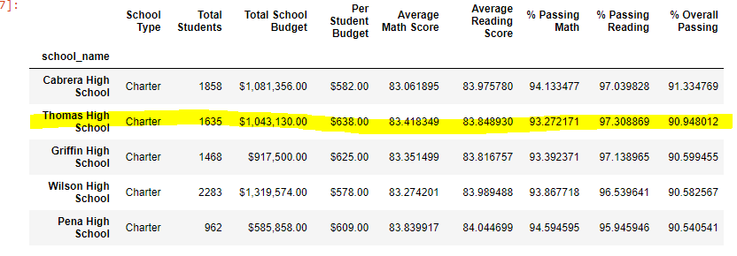
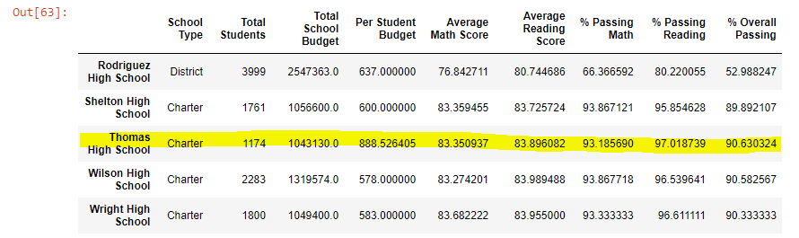

# An Analysis of School District Data: Determination of Scores, Budgets, and Outcomes
Upon working with Maria on the provided school district data, she was informed that the math and reading scores of ninth graders from Thomas High School were entered inaccurately. As a result of the discovery, we needed to exclude ninth graders from Thomas High School from our analysis as to not influence data accuracy. After they are successfully removed, we re-ran all calculations to get an analysis that was not wrongly influenced.

## The Results

The removal of the false data certainly impacted district results, but the impact is also noticable on THS data as a whole.
- The Budget and the Total Students of THS and the district did not change.
- The district numbers were influenced by the false data. From the first picture (before the exclusion) you can see that the Average Math score was 0.1 higher than when the false data was removed. % Passing Math was also 0.2 higher than it should have been. The % Passing Reading was 0.3 higher than it should have been, and % Overall Passing was 0.1 higher than it should have been. Clearly, district data was influenced by incorrect data, giving higher than realistic scores.
- Thomas High School data was also influenced. From the third picture (before exclustion), Average Math scores were 0.068 higher than they should have been; Average Reading scores were 0.048 lower than they should have been; % Passing Math was 0.087 higher than is should have been; % Passing Reading was 0.29 higher than it should have been; % Overall Passing was 0.318 higher than it should have been.

