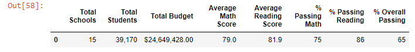
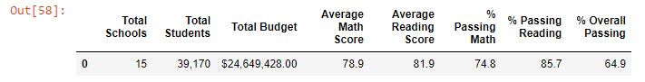

# An Analysis of School District Data: Determination of Scores, Budgets, and Outcomes
Upon working with Maria on the provided school district data, she was informed that the math and reading scores of ninth graders from Thomas High School were entered inaccurately. As a result of the discovery, we needed to exclude ninth graders from Thomas High School from our analysis as to not influence data accuracy. After they are successfully removed, we re-ran all calculations to get an analysis that was not wrongly influenced.

## The Results

The removal of the false data certainly impacted district results, but the impact is also noticable on THS data as a whole.
- The Budget and the Total Students of THS and the district did not change.

